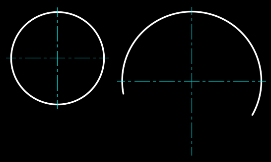

# Eksen Çiz (AutoLisp uygulama)
Bu AutoLISP uygulaması, AutoCAD programında seçilen çember veya yay için dikey ve yatay eksenler çizer.

## Özellikler
- Çember veya yay için dikey ve yatay eksen çizgisi oluşturur.
- Eksen çizgilerinin uçları, ayarlanan değer kadar dışarı taşar. Çıkıntı ayarlanmadıysa varsayılan değer `3` birimdir. Çıkıntı menü ile ayarlanabilir. Negatif değer çıkıntı yerine girinti oluşturur.
- Çizimler `EKSEN` adlı bir katmanda yapılır.\
Katman yoksa katman eklenir ve aşağıdaki özellikler atanır.\
**Çizgi tipi:** `CENTER` \
**Çizgi rengi:** `4` $${\color{cyan}■}$$ (cyan = cam göbeği)\
Katman varsa **çizgi tipi** ve **çizgi rengi** değiştirilmez.
- Hata yönetimi ve geri alma (undo) desteği bulunur.

## Yükleme ve çalıştırma
### Yükleme
AutoCAD komut satırına `APPLOAD` yazın, `EKSEN-CIZ.LSP` dosyasını seçip Load tıklayın.

### Komutu Çalıştırma
AutoCAD Komut satırına `EKSEN` yazıp `Enter` tuşuna basın.

### Menü elemanları
`EKSEN` komutu çalıştırıldığında menüde aşağıdaki seçenekler çıkar
- Merkez noktası belirle
- Nesne seç
- Çıkıntı ayarla
- Geri al
- Çıkış

### Menü elamanını seçme
- Komut satırında üzerinde tıklayarak
- Menüdeki büyük harfi klavyeden girerek
- Çizim alanında sağ tıklayıp menüden tıklayarak

## Menü elemanlarının işlevleri
- **Merkez noktası belirle**. Bir seçnek seçilmezse merkez noktası ardından eksen yarıçapı belirlenir. Belirlenen merkeze eksenler çizilir.
- **Nesne seç**. Varsayılan seçenektir. `Enter` veya `Boşluk` ile de seçilebilir. Çember(ler) ve/veya yay(lar) seçilir. Seçimi tamamlamak için `Enter` tuşuna basılır. Seçilen nesnelere eksenler çizilir.
- **Çıkıntı ayarla**. Başlangıç değeri `3` birimdir. Çıkıntı miktarı ayarlanbilir. Negatif değerler ters çıkıntı(girinti) oluşturur.
- **Geri al**. Son çizilen dikey ve yatay ekseni iptal eder.
- **Çıkış**. Program sonsuz döngü ile devam eder. Döngüden çıkmak için `Çıkış` seçeneğini seçin veya `ESC` tuşuna basın.

## Lisans
Bu uygulama **Mesut Akcan** tarafından geliştirilmiştir. Kaynak belirtmeden paylaşılamaz. Ücretsizdir. Satılamaz.

## İletişim
- **E-posta:** makcan@gmail.com  
- **YouTube Kanalım:** [Mesut Akcan](https://www.youtube.com/mesutakcan)  
- **Blog sayfam:** [Mesut Akcan Blog](https://mesutakcan.blogspot.com)  
> Daha fazla bilgi ve AutoCAD ile ilgili içerikler için [YouTube kanalımı](https://www.youtube.com/mesutakcan) ziyaret edebilirsiniz.

## Katkıda Bulunma
Katkılarınız memnuniyetle karşılanır!\
Özellikler eklemek, hataları düzeltmek veya kodu geliştirmek isterseniz, bir [çekme isteği (Pull Request)](https://github.com/akcansoft/eksen-ciz-autolisp/pulls) açmaktan çekinmeyin.
